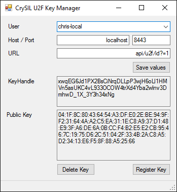
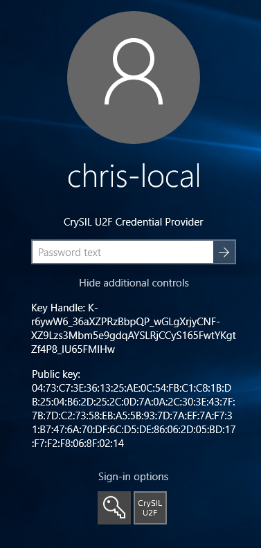
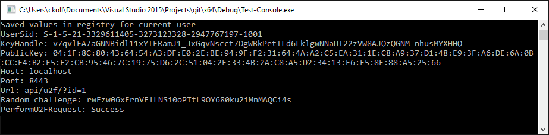

# CrySIL U2F Windows Credential Provider

This [Credential Provider](https://msdn.microsoft.com/en-us/library/windows/desktop/mt158211%28v=vs.85%29.aspx) enables a Windows account to use a CrySIL U2F service to use secure second factor authentication for logging in.

Building the code requires [Visual Studio](https://www.visualstudio.com/en-us/downloads) and the [Windows SDK](https://dev.windows.com/en-us/downloads/windows-10-sdk). It is tested with Visual Studio 2015 under Windows 10 using the Windows SDK for Windows 10.

Prerequisites:

* A server instance of CrySIL supporting U2F operations
* Any account on the Windows machine

Procedure to run the whole project:

* Build and run [Control U2F Keys](./ControlU2FKeys/) to configure the CrySIL server connection
* Use the same program to register a U2F Key
* Run [Install.bat](./Install.bat) with elevated rights (e.g. as Administrator) to build and install the credential provider
* On next login select the “CrySIL U2F” tile and enter your password as always
* The credential provider will try to verify your registered key by sending a U2F authentication request to the CrySIL instance
* If this request or the verification of the response fails, the credential provider will deny access to the system

## Control U2F Keys

This application is required to configure the server connection and register a U2F Key to use for login. It requires elevated rights to store the configuration options in the registry (`HKEY_LOCAL_MACHINE\Software\CrySIL\U2F`). There, a key is created using the UserSID of the Windows account. Storing this data in the user-writeable section of the registry (`HKEY_CURRENT_USER`) is not an option, since this registry hive is not loaded prior to login and therefore can't be accessed by the credential provider.

## Credential Provider 

The code for the [Credential Provider](./CredentialProvider/) is based on [sample code from Microsoft](https://github.com/Microsoft/Windows-classic-samples/tree/master/Samples/CredentialProvider/).

The credential provider can be selected on login by selecting the appropriate tile under “Sign-in options”. It performs a U2F authentication if the user selected has a key handle stored in the registry. It may prompt for a secret value authentication by showing a dialog, if requested by the CrySIL instance. The credential provider logs error messages to the file `C:\logfile.txt`.

## Test Console

This program reads the values saved in the registry and uses the code of the credential provider to perform a U2F authentication. It may prompt for a secret value authentication on the console if requested by CrySIL.

